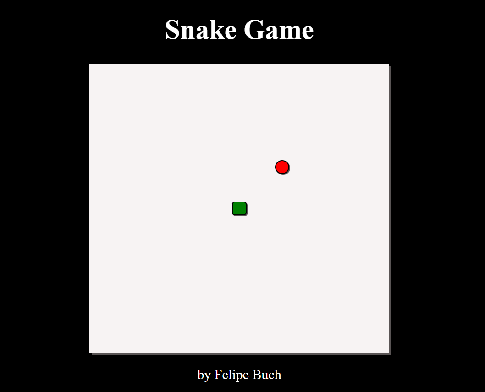

<h2 align="center">
Snake Game 
  <a href="https://snakegamejavascript.netlify.app/" target="_blank">Link do Snake</a>
</h2>

  

 

Este projeto foi construído utilizando as seguintes tecnologias.

JavaScript
HTML
CSS

Começando
Clone este repositório. Você precisa ter node.js e git instalados globalmente em sua máquina.

🛠 Instruções de instalação e configuração
Instalação:
npm install

No diretório do projeto, você pode executar: npm start

Executa o aplicativo no modo de desenvolvimento.
Abra http://localhost:3000 para visualizá-lo no navegador.
A página será recarregada se você fizer edições.
